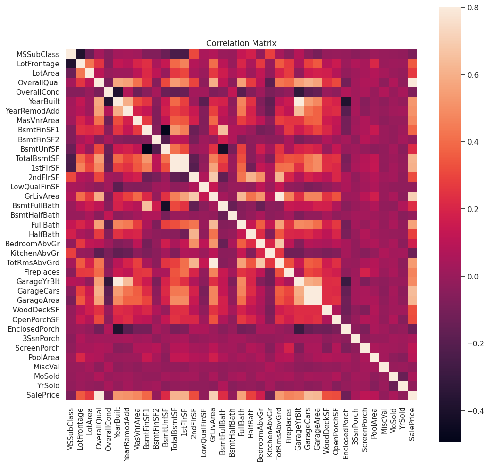
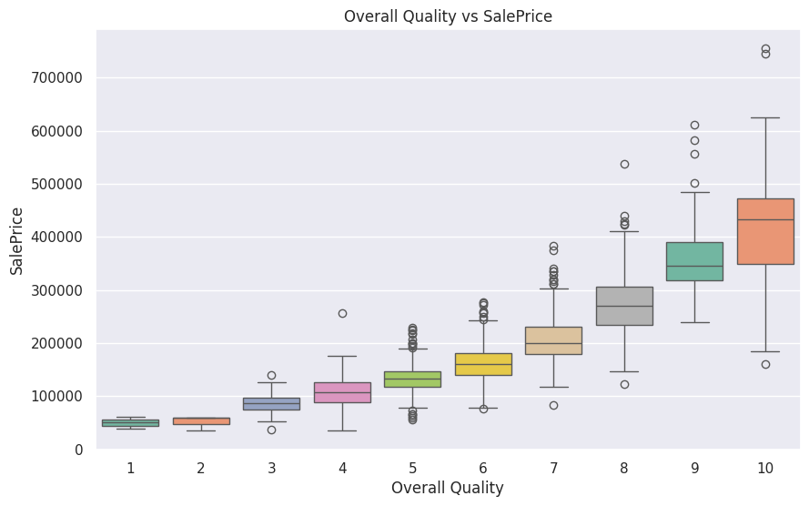
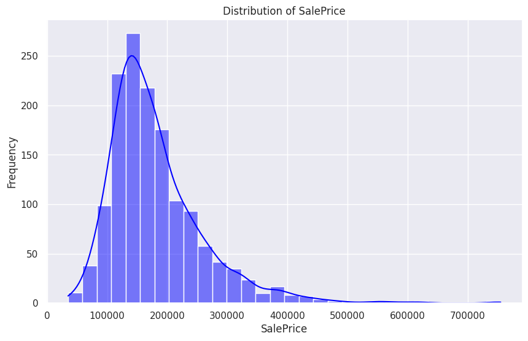
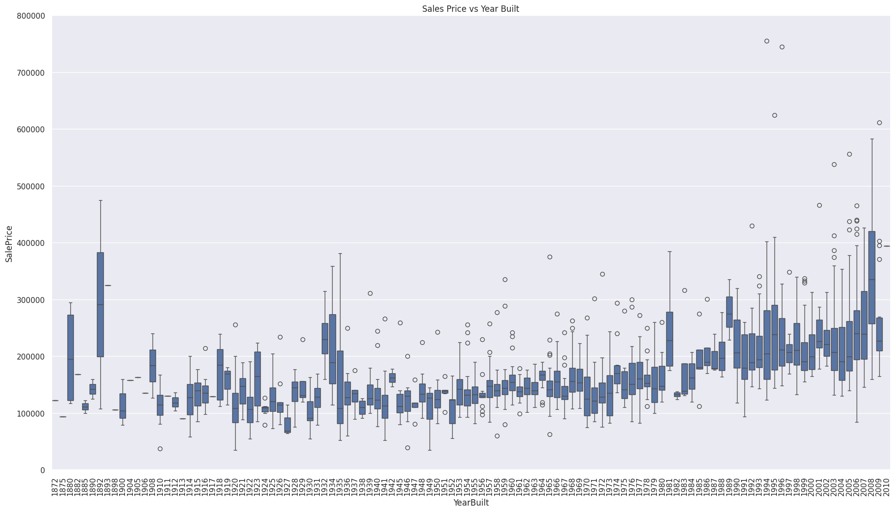
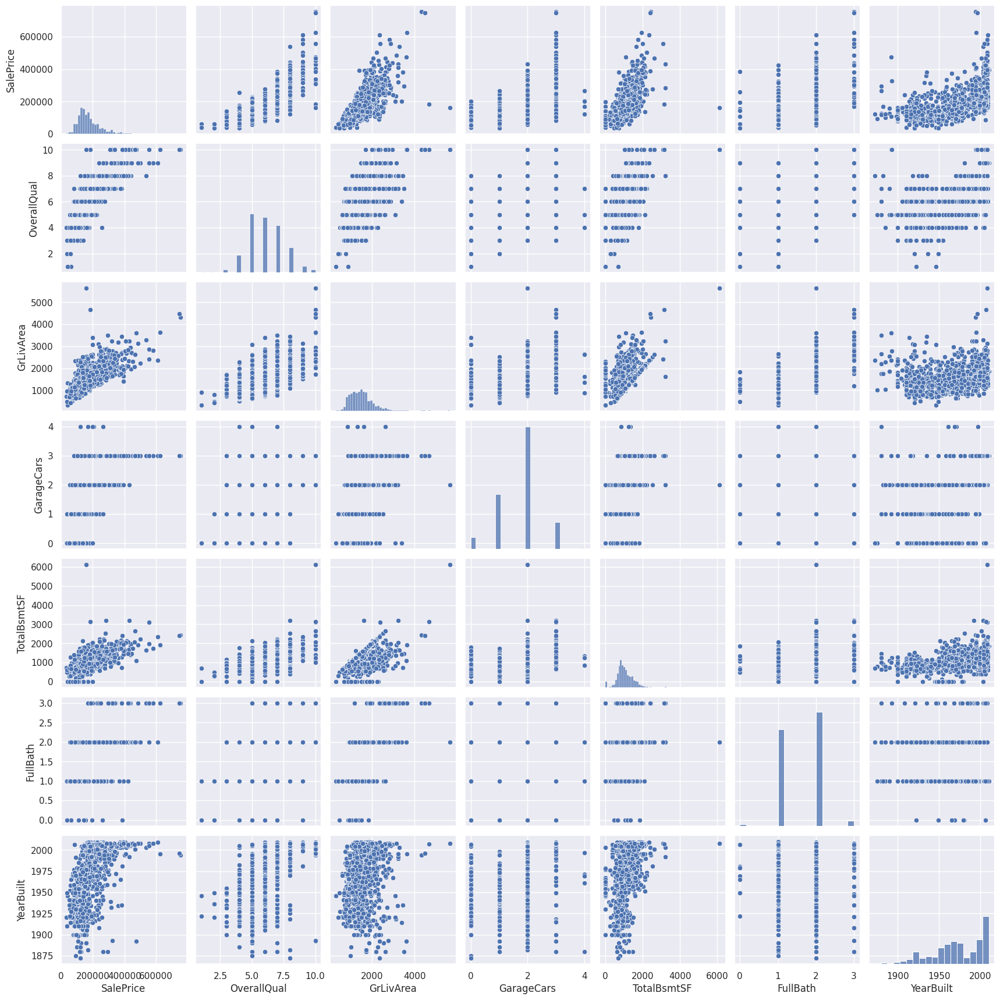

# DNSC3288_Project_G6

### Basic Information

* **Person or organization developing model**: Ashley Chen, `ashley@gw.edu`; Jonathan Daniel, `jonathan@gw.edu`; Jacob Ifrah, `jacob@gw.edu`; Tina Zhou, `tina@gw.edu`

* **Model date**: December, 2024
* **Model version**: 1.0
* **License**: MIT
* **Model implementation code**: [DNSC3288_Project_G6.ipynb](https://github.com/aashleychen/DNSC3288_Project/blob/0b26c06226d3dad722abebd9b33f734cc8a4080c/DNSC3288_Project_G6.ipynb)

### Intended Use
* **Primary intended uses**: This model is for educational purposes only.
* **Primary intended users**: Students and people learning about Machine Learning. 
* **Out-of-scope use cases**: Any use beyond an educational example is out-of-scope.

### Training Data

* Data dictionary: 

| Name               | Role     | Type     | Description                                                                                                   |
|--------------------|----------|----------|---------------------------------------------------------------------------------------------------------------|
| **ID**             | ID       | int      | Unique row identifier.                                                                                        |
| **MSSubClass**     | Input    | int      | Identifies the type of dwelling involved in the sale.                                                         |
| **MSZoning**       | Input    | object   | General zoning classification of the sale.                                                                   |
| **LotFrontage**    | Input    | float    | Linear feet of street connected to the property.                                                              |
| **LotArea**        | Input    | int      | Lot size in square feet.                                                                                      |
| **Street**         | Input    | object   | Type of road access to property (`Grvl`, `Pave`).                                                             |
| **Alley**          | Input    | object   | Type of alley access to property (`Grvl`, `Pave`, `NA`).                                                      |
| **LotShape**       | Input    | object   | General shape of the property (`Reg`, `IR1`, `IR2`, `IR3`).                                                   |
| **LandContour**    | Input    | object   | Flatness of the property (e.g., `Lvl`, `Bnk`, `HLS`, `Low`).                                                  |
| **Utilities**      | Input    | object   | Type of utilities available (e.g., `AllPub`, `NoSewr`, `NoSeWa`, `ELO`).                                      |
| **LotConfig**      | Input    | object   | Lot configuration (e.g., `Inside`, `Corner`, `CulDSac`, `FR2`, `FR3`).                                        |
| **LandSlope**      | Input    | object   | Slope of property (`Gtl`, `Mod`, `Sev`).                                                                      |
| **Neighborhood**   | Input    | object   | Physical locations within Ames city limits.                                                                   |
| **Condition1**     | Input    | object   | Proximity to various conditions (e.g., `Artery`, `Feedr`, `Norm`, `PosN`).                                    |
| **Condition2**     | Input    | object   | Secondary proximity conditions (if more than one is present).                                                 |
| **BldgType**       | Input    | object   | Type of dwelling (e.g., `1Fam`, `2FmCon`, `Duplx`, `TwnhsE`, `TwnhsI`).                                        |
| **HouseStyle**     | Input    | object   | Style of dwelling (e.g., `1Story`, `2Story`, `SFoyer`).                                                       |
| **OverallQual**    | Input    | int      | Rates the overall material and finish of the house (1 = Very Poor, 10 = Very Excellent).                      |
| **OverallCond**    | Input    | int      | Rates the overall condition of the house (1 = Very Poor, 10 = Very Excellent).                                |
| **YearBuilt**      | Input    | int      | Original construction date.                                                                                   |
| **YearRemodAdd**   | Input    | int      | Remodel date (same as construction date if no remodeling or additions).                                       |
| **RoofStyle**      | Input    | object   | Type of roof (`Flat`, `Gable`, `Hip`, etc.).                                                                  |
| **RoofMatl**       | Input    | object   | Roof material (`ClyTile`, `CompShg`, `Membran`, `Metal`, etc.).                                               |
| **Exterior1**      | Input    | object   | Exterior covering on house (`VinylSd`, `HdBoard`, `Stucco`, etc.).                                            |
| **Exterior2**      | Input    | object   | Secondary exterior covering on house (if more than one).                                                      |
| **MasVnrType**     | Input    | object   | Masonry veneer type (`BrkCmn`, `BrkFace`, `Stone`, etc.).                                                     |
| **MasVnrArea**     | Input    | float    | Masonry veneer area in square feet.                                                                           |
| **ExterQual**      | Input    | object   | Evaluates the quality of the material on the exterior (`Ex`, `Gd`, `TA`, `Fa`, `Po`).                         |
| **ExterCond**      | Input    | object   | Evaluates the present condition of the material on the exterior.                                              |
| **Foundation**     | Input    | object   | Type of foundation (`BrkTil`, `CBlock`, `PConc`, etc.).                                                       |
| **BsmtQual**       | Input    | object   | Evaluates the height of the basement (`Ex`, `Gd`, `TA`, `Fa`, `Po`, `NA`).                                    |
| **BsmtCond**       | Input    | object   | Evaluates the general condition of the basement.                                                              |
| **BsmtExposure**   | Input    | object   | Refers to walkout or garden level walls (`Gd`, `Av`, `Mn`, `No`, `NA`).                                       |
| **BsmtFinType1**   | Input    | object   | Rating of basement finished area (`GLQ`, `ALQ`, `Rec`, etc.).                                                 |
| **BsmtFinSF1**     | Input    | int      | Type 1 finished square feet.                                                                                  |
| **BsmtFinType2**   | Input    | object   | Secondary rating of basement finished area.                                                                   |
| **BsmtFinSF2**     | Input    | int      | Type 2 finished square feet.                                                                                  |
| **BsmtUnfSF**      | Input    | int      | Unfinished square feet of basement area.                                                                      |
| **TotalBsmtSF**    | Input    | int      | Total square feet of basement area.                                                                           |
| **Heating**        | Input    | object   | Type of heating system (`Floor`, `GasA`, `Wall`, etc.).                                                       |
| **HeatingQC**      | Input    | object   | Heating quality and condition (`Ex`, `Gd`, `TA`, `Fa`, `Po`).                                                 |
| **CentralAir**     | Input    | object   | Central air conditioning (`Y` = Yes, `N` = No).                                                               |
| **Electrical**     | Input    | object   | Electrical system (`SBrkr`, `FuseA`, etc.).                                                                   |
| **1stFlrSF**       | Input    | int      | First floor square feet.                                                                                      |
| **2ndFlrSF**       | Input    | int      | Second floor square feet.                                                                                     |
| **LowQualFinSF**   | Input    | int      | Low quality finished square feet (all floors).                                                                |
| **GrLivArea**      | Input    | int      | Above grade (ground) living area square feet.                                                                 |
| **BsmtFullBath**   | Input    | int      | Basement full bathrooms.                                                                                      |
| **BsmtHalfBath**   | Input    | int      | Basement half bathrooms.                                                                                      |
| **FullBath**       | Input    | int      | Full bathrooms above grade.                                                                                   |
| **HalfBath**       | Input    | int      | Half baths above grade.                                                                                       |
| **BedroomAbvGr**   | Input    | int      | Bedrooms above grade (does NOT include basement bedrooms).                                                    |
| **KitchenAbvGr**   | Input    | int      | Kitchens above grade.                                                                                         |
| **KitchenQual**    | Input    | object   | Kitchen quality (`Ex`, `Gd`, `TA`, `Fa`, `Po`).                                                               |
| **TotRmsAbvGrd**   | Input    | int      | Total rooms above grade (does not include bathrooms).                                                         |
| **Fireplaces**     | Input    | int      | Number of fireplaces.                                                                                         |
| **GarageType**     | Input    | object   | Garage location (`Attchd`, `Detchd`, etc.).                                                                   |

| **GarageYrBlt**    | Input    | float    | Year garage was built.                                                                                        |
| **GarageFinish**   | Input    | object   | Interior finish of the garage (`Fin`, `RFn`, `Unf`).                                                          |
| **GarageCars**     | Input    | int      | Size of garage in car capacity.                                                                               |
| **GarageArea**     | Input    | int      | Size of garage in square feet.                                                                                |
| **GarageQual**     | Input    | object   | Garage quality (`Ex`, `Gd`, `TA`, `Fa`, `Po`).                                                                |
| **GarageCond**     | Input    | object   | Garage condition (`Ex`, `Gd`, `TA`, `Fa`, `Po`).                                                              |
| **PavedDrive**     | Input    | object   | Paved driveway (`Y`, `P`, `N`).                                                                               |
| **WoodDeckSF**     | Input    | int      | Wood deck area in square feet.                                                                                |
| **OpenPorchSF**    | Input    | int      | Open porch area in square feet.                                                                               |
| **EnclosedPorch**  | Input    | int      | Enclosed porch area in square feet.                                                                           |
| **3SsnPorch**      | Input    | int      | Three season porch area in square feet.                                                                       |
| **ScreenPorch**    | Input    | int      | Screen porch area in square feet.                                                                             |
| **PoolArea**       | Input    | int      | Pool area in square feet.                                                                                     |
| **PoolQC**         | Input    | object   | Pool quality (`Ex`, `Gd`, `TA`, `Fa`, `NA`).                                                                  |
| **Fence**          | Input    | object   | Fence quality (`GdPrv`, `MnPrv`, `GdWo`, `MnWw`, `NA`).                                                       |
| **MiscFeature**    | Input    | object   | Miscellaneous feature not covered in other categories (`Elev`, `Gar2`, etc.).                                 |
| **MiscVal**        | Input    | int      | Value of miscellaneous feature.                                                                               |
| **MoSold**         | Input    | int      | Month sold (1-12).                                                                                            |
| **YrSold**         | Input    | int      | Year sold (YYYY).                                                                                             |
| **SaleType**       | Input    | object   | Type of sale (`WD`, `CWD`, `VWD`, `New`, etc.).                                                               |
| **SaleCondition**  | Input    | object   | Condition of sale (`Normal`, `Abnorml`, `AdjLand`, `Alloca`, `Family`, `Partial`).                            |
| **SalePrice**      | Output   | int      | Sale price of the property in dollars (target variable).                                                      |


* **Source of training data**: https://www.kaggle.com/competitions/house-prices-advanced-regression-techniques/data?select=train.csv 
* **How training data was divided into training and validation data**: 80% training, 20% validation
* **Number of rows in training and validation data**:
  * Training rows: 1,168
  * Validation rows: 292

### Test Data
* **Source of test data**: https://www.kaggle.com/competitions/house-prices-advanced-regression-techniques/data?select=test.csv
* **Number of rows in test data**: 1,459
* **State any differences in columns between training and test data**: The training data has labels while the test data doesn’t. 

### Model details
* **Columns used as inputs in the final model**: ‘'MSSubClass', 'MSZoning', 'LotFrontage', 'LotArea', 'Street','Alley', 'LotShape', 'LandContour', 'Utilities', 'LotConfig', 'LandSlope', 'Neighborhood', 'Condition1', 'Condition2', 'BldgType', 'HouseStyle', 'OverallQual', 'OverallCond', 'YearBuilt', 'YearRemodAdd', 'RoofStyle', 'RoofMatl', 'Exterior1st', 'Exterior2nd', 'MasVnrType','MasVnrArea', 'ExterQual', 'ExterCond', 'Foundation', 'BsmtQual', 'BsmtCond', 'BsmtExposure', 'BsmtFinType1', 'BsmtFinSF1', 'BsmtFinType2', 'BsmtFinSF2', 'BsmtUnfSF', 'TotalBsmtSF', 'Heating', 'HeatingQC', 'CentralAir', 'Electrical', '1stFlrSF', '2ndFlrSF','LowQualFinSF', 'GrLivArea', 'BsmtFullBath', 'BsmtHalfBath', 'FullBath', 'HalfBath', 'BedroomAbvGr', 'KitchenAbvGr', 'KitchenQual', 'TotRmsAbvGrd', 'Functional', 'Fireplaces', 'FireplaceQu', 'GarageType', 'GarageYrBlt', 'GarageFinish', 'GarageCars', 'GarageArea', 'GarageQual', 'GarageCond', 'PavedDrive', 'WoodDeckSF', 'OpenPorchSF', 'EnclosedPorch', '3SsnPorch', 'ScreenPorch', 'PoolArea', 'PoolQC', 'Fence', 'MiscFeature', 'MiscVal', 'MoSold', 'YrSold', 'SaleType', 'SaleCondition'
* **Column(s) used as target(s) in the final model**: ‘SalePrice’
* **Type of model**: LightGBM 
* **Software used to implement the model**: Python, scikit-learn, matplotlib, numpy, pandas, seaborn, lightgbm
* **Version of the modeling software**: matplotlib: 3.8.0, numpy: 1.26.4, pandas: 2.2.2, seaborn: 0.13.2, scikit-learn: 1.5.2, lightgbm: 4.5.0, Python version: 3.10.12
* **Hyperparameters or other settings of your model**: 
```
LGBMRegressor(objective='regression',
                         num_leaves=5,
                         learning_rate=0.05,
                         n_estimators=720,
                         max_bin = 55,
                         bagging_fraction = 0.8,
                         bagging_freq = 5,
                         feature_fraction = 0.2319,
                         feature_fraction_seed=9,
                         bagging_seed=9,
                         min_data_in_leaf =6,
                         min_sum_hessian_in_leaf = 11,
                         verbose=-1)
```
### Quantitative Analysis

* Models were assessed primarily with RMSE. See details below:

| Train RMSE | Validation RMSE | Test RMSE |
| ------ | ------- | -------- |
| 0.1223 | 0.1526  | 0.1263 |

#### Correlation Heatmap


#### Overall Quality vs SalePrice


#### SalePrice


#### SalePrice by YearBuilt


#### Scatterplot of Features

